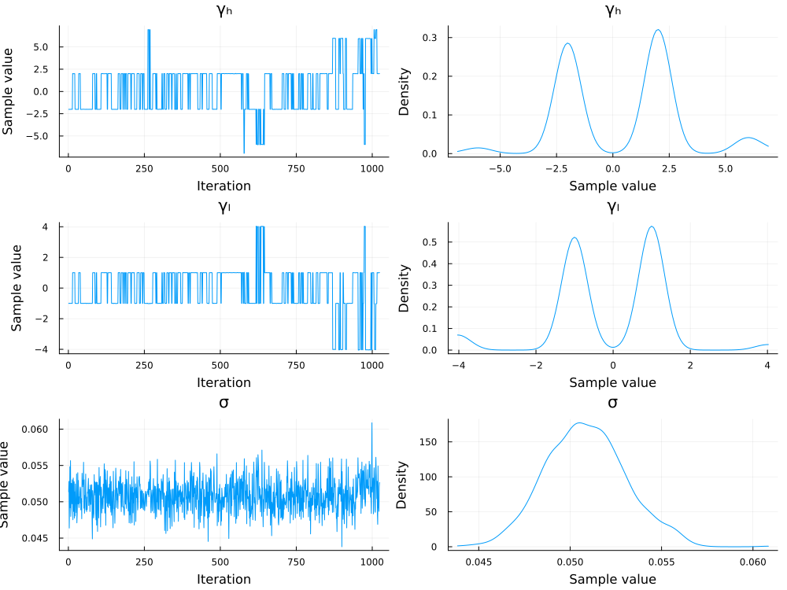

# Parameter Estimation

This brief tutorial explains how to performance Bayesian parameter estimation of the quantum context effect model (QCEM) using [Pigeons.jl](https://github.com/Julia-Tempering/Pigeons.jl). One complication in estimating the parameters of the QCEM is that the posterior distributions may have multiple modes, which leads to convergence problems with most MCMC algorithms. Pigeons.jl uses a special type of parallel tempering to overcome this challenge. An additional advantage of using Pigeons.jl is the ability to compute Bayes factors from the log marginal likelihood using the function `stepping_stone`.

```@raw html
<details>
<summary><b>Show Code</b></summary>
```
```@example model_preds
using QuantumContextEffectModels
using Plots 
parms = (
    Ψ = sqrt.([.3,.1,.2,.4]),
    θil = .3,
    θpb = .3,
)
θils = range(-1, 1, length=1001)
preds = map(
        θil -> predict(
            QuantumModel(; parms..., θil); 
            joint_func = get_joint_probs,
            n_way = 2
        ), θils)

preds = map(p -> p[5], preds)

preds = stack(preds)'
p1 = plot(θils[1:500], preds[1:500,:], leg=false, title="first half [-1,0)")
p2 = plot(θils[1:500], preds[501:end-1,:], leg=false, title="second half [0,1)")
plot(p1, p2, layout=(2,1))
```
```@raw html
</details>
```

## Load Packages

First, we will load the required packages below. 

```julia
using Pigeons
using QuantumContextEffectModels
using Random
using StatsPlots
using Turing
```

## Generate Simulated Data

The next step is to generate some simulated data from which the parameters can be estimated. In the code block below, the utility parameter $\mu_d$ is set to one and the entanglement parameter is set to $\gamma = 2$.  A total of 50 trials is generated for each of the three conditions. The resulting values represent the number of defections per condition out of 50.
```julia
Random.seed!(84)
n_trials = 25
n_way = 2
parms = (
    Ψ = sqrt.([.7,.1,.1,.1]),
    θil = .6,
    θpb = .3,
)
model = QuantumModel(; parms...)
data = rand(model, n_trials; n_way)
```

## Define Turing Model

The next step is to define a Turing model with the `@model` macro. We will estimate the entanglement parameters using the prior $\gamma_j \sim \mathrm{normal}(0,3)$. The other parameters will be fixed to the data generating values defined in the code block above.

```julia 
@model function turing_model(data, parms, n_trials; n_way)
    θil ~ Uniform(0, 1)
    θpb ~ Uniform(0, 1)
    model = QuantumModel(; parms..., θil, θpb)
    Turing.@addlogprob! logpdf(model, data, n_trials; n_way)
end

sampler = turing_model(data, parms, n_trials; n_way)
```

## Estimate Parameters

To estimate the parameters, we need to pass the Turing model to `pigeons`. The second command converts the output to an `MCMCChain` object, which can be used for plotting
```julia
pt = pigeons(
    target=TuringLogPotential(sampler), 
    record=[traces],
    multithreaded=true)
samples = Chains(sample_array(pt), ["θil", "θbp", "LL"])
plot(samples)
```

```julia 
chain = sample(sampler, NUTS(1000, .85), MCMCThreads(), 1000, 4)
plot(chain)
```
The trace of the `pigeon`'s sampler is given below:
```julia
────────────────────────────────────────────────────────────────────────────
  scans        Λ      log(Z₁/Z₀)   min(α)     mean(α)    min(αₑ)   mean(αₑ) 
────────── ────────── ────────── ────────── ────────── ────────── ──────────
        2        4.9       -150          0      0.456      0.857      0.961 
        4       2.47        402   1.61e-23      0.726      0.973      0.997 
        8       5.03        444   0.000401      0.441          1          1 
       16       5.27        459      0.136      0.415      0.993      0.999 
       32       6.11        461     0.0646      0.321          1          1 
       64       5.51        466      0.232      0.388          1          1 
      128       5.13        470      0.257       0.43      0.997          1 
      256       5.18        469      0.311      0.425      0.998          1 
      512       5.14        469      0.347      0.429      0.999          1 
 1.02e+03       5.14        469      0.398      0.429      0.998          1 
────────────────────────────────────────────────────────────────────────────
```

## Plot Posterior Distribution 

Now we can plot the posterior distribution of $\gamma$ with `plot`. The posterior distribution of $\gamma$ has a primary mode around 1 and secondary modes around 2 and 3.5.
```julia 
plot(samples)
```

